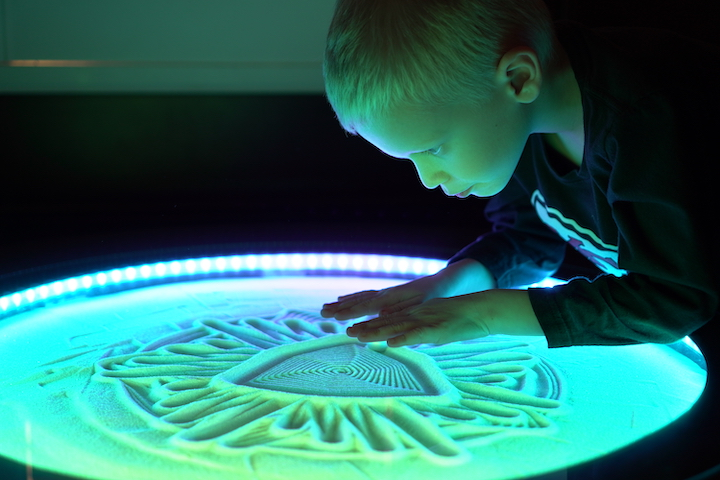

# Sand Table Pattern Maker

[Demo](https://markroland.github.io/sand-table-pattern-maker/)

This is part of my [Sand Table Build](https://markroland.github.io/sand-table-build/)

Built with [p5.js](https://p5js.org)

## How to Build a New Pattern

In order to build a new pattern a few things must be done:

1. Create a Pattern Class and save it to the `assets/js/patterns` folder
2. Link to Pattern Class file in `index.html`
3. Add the Pattern Class to the `Patterns` config in the main sketch file (`sand_table_pattern_maker.js`).
   This object must have a key that matches the class's `this.key` value and the object value
   must be a Class instantiation.

Pattern classes are made up of at least 4 classes:

 - **constructor** - The class constructor defines a few aspect of the class including:
   - `this.key` - Used for identifying the class's properties in the main sketch file
   - `this.name` - Used for referencing the pattern in the UI.
   - `this.config` - This is an object that defines the pattern's input configuration options.
   - `this.path` - Initializes the pattern's output path coordinates
 - **setup** - This class is called by the main sketch and is used to define the options
   available to the pattern.
 - **draw** - This class is called by the main sketch to draw the pattern. It reads and
   updates the UI input values and sends the input to the class's `calc` method.
 - **calc** - This is where the algorithm for the pattern is implemented. Using the selected
   inputs, the method returns the coordinates for the complete path.
